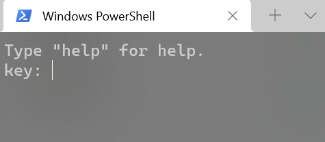
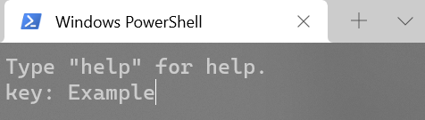
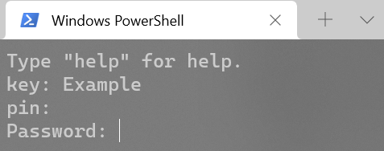
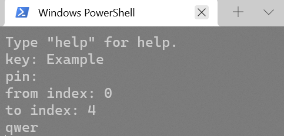
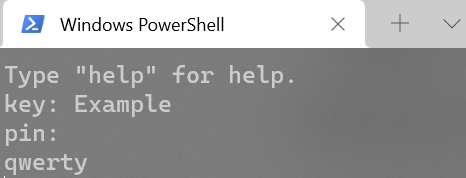

# Password hider

Password hider is a simple commandline program used to quickly save passwords without anyone near you seeing them. It can also print the passwords backout complete or in slices.

**Table of content**

* [Warnings](#warnings)

* [Why](#why)

* [How to](#how-to)
  
  * [Add Password](#add-password)
  
  * [Read Password](#read-password)
  
  * [Toggle options](#toggle-options)
  
  * [Save and quit](#save-and-quit)

* [Installation](#installation)

### Warnings

This program should not be used as a password manager. The encryption is minimal, and can be cracked by anyone who knows anything about encryption. It can expose your passwords if you check them in public.

### Why

Sometimes you have to make a new password, and sometimes you don't want to use one of your standard passwords or maybe the website or application needs a very secure password, so you have to make a new password. But you don't have any way to save the password since you are in public and wouldn't want anyone to see it if they accidently look at your screen.

This is the exactly the purpose of this program, it is to quickly store or check new passwords when you are in public. **It is basicly a slightly safer .txt**.

### How to

*Image of how the program looks like when run*

**Available commands:**

* **help** - shows all available commands

* **save** - saves all changes made

* **quit** - closes the program

* **toggle [args]** - toggles the args

* **config** - prints out config

#### Add password

1. First enter the key (identifier) you want to use for the password

2. Enter a pin and password when promted

#### Read password

###### With default settings

1. Enter the key and pin when promted

2. Enter where to start and end the slice

###### With show all option

All you have to do when the show all option is on is type in the key and pin when promted.

#### Toggle options

1. Type `config` to see all options (optional)

2. Type `toggle` and what option or options you want to change

#### Save and quit

To save type `save`, and to quit type `quit`.

### Installation

The installation for this program is very simple.

1. Have som version of [Python 3](https://www.python.org/) installed (only tested on 3.10.1)

2. Download or clone this repository
